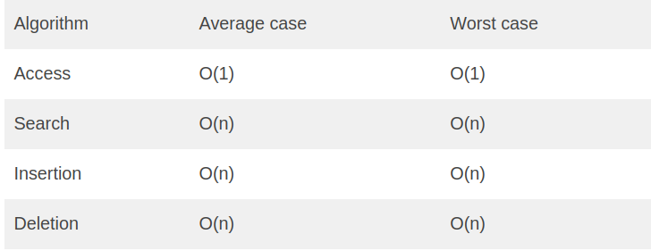

# Array

### What is an Array?
> An aray is a collection of items of same data types stored at contiguous memory locations.

 **For Example:** 
 If we want to store the marks scored by a student in 5 subjects, then there’s no need to define individual variables for each subject. Rather, we can define an array that will store the data elements at contiguous memory locations.

 ## Need of Array (nerds stuff):

1. **Collection of Data**: Arrays allow you to store multiple values (of the same type or different types) in a single variable. This makes it easier to manage and manipulate collections of data.

2. **Sequential Access:** Arrays provide indexed access to elements, meaning you can access any element directly by its position (index) in the array. This allows for efficient retrieval and modification of data.

3. **Iteration:** Arrays support iteration, which means you can easily loop through all elements in the array and perform operations on them.

4. **Ordered Data:** Arrays maintain the order of elements, which is important in scenarios where the sequence of elements matters, such as maintaining the order of tasks in a to-do list or the order of items in a shopping cart.

5. **Efficient Memory Allocation:** Arrays allocate contiguous memory locations, which allows for efficient memory management and access.

6. **Flexibility:** Arrays can hold different types of data, including numbers, strings, objects, or even other arrays. This flexibility makes them versatile for a wide range of use cases.

7. **Data Structures:** Arrays serve as the foundation for more complex data structures like stacks, queues, and matrices. These data structures are built on top of arrays to provide additional functionalities and features.

## The Complexity of Array Operations:
**Time Complexity**

